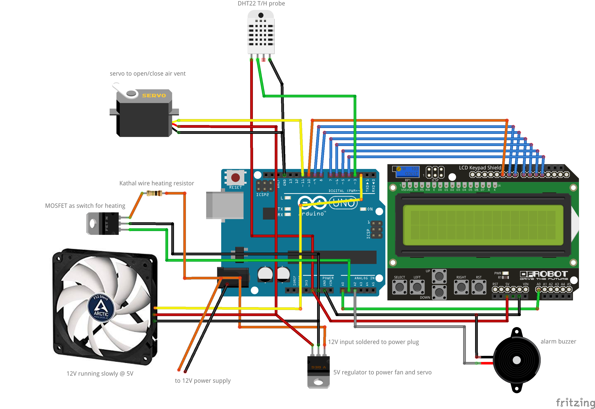
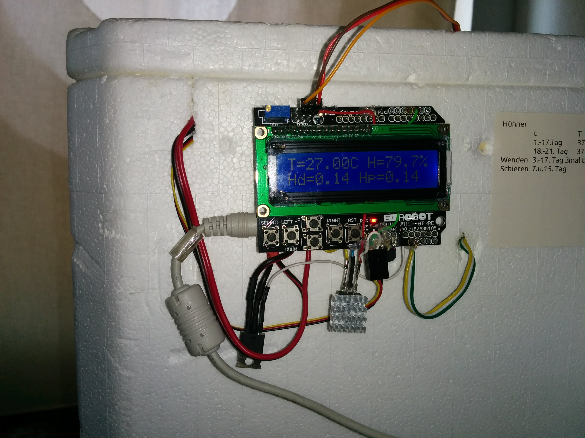
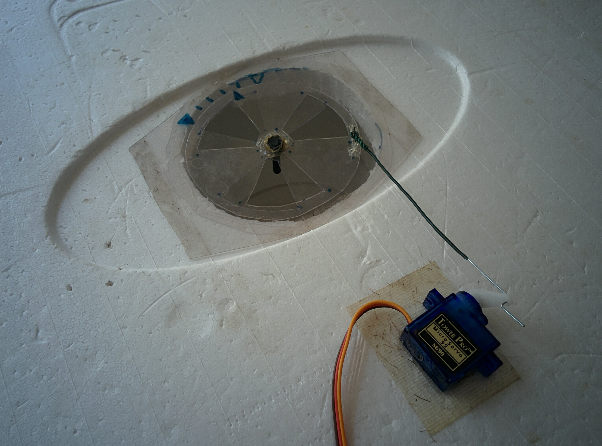
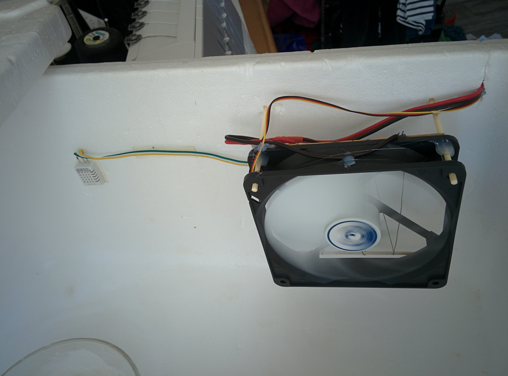
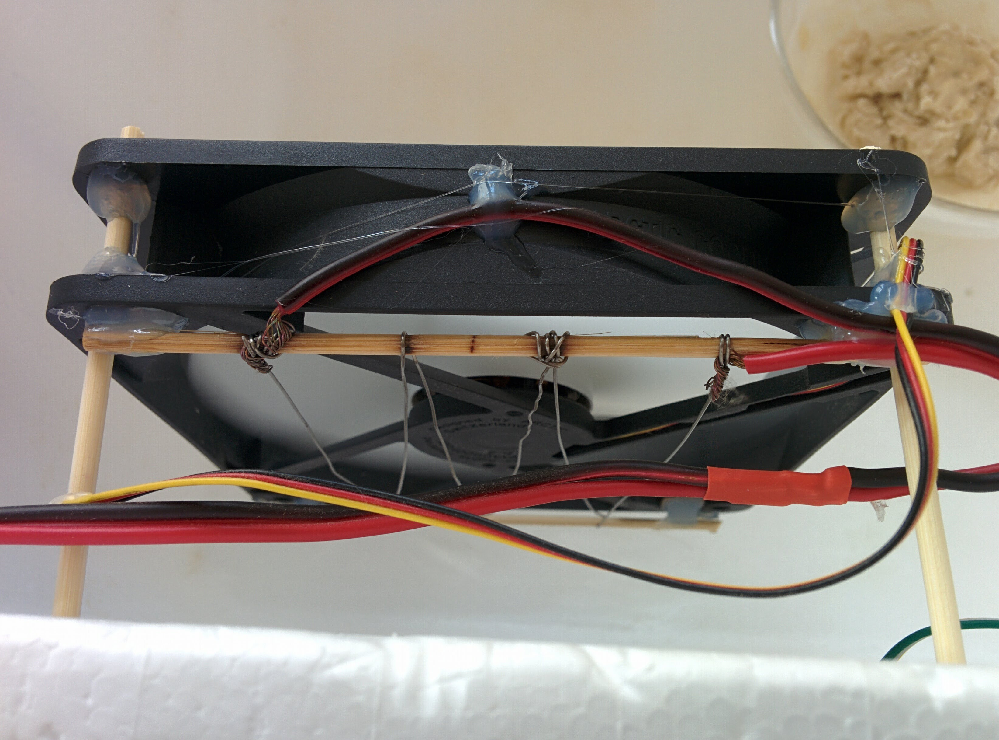
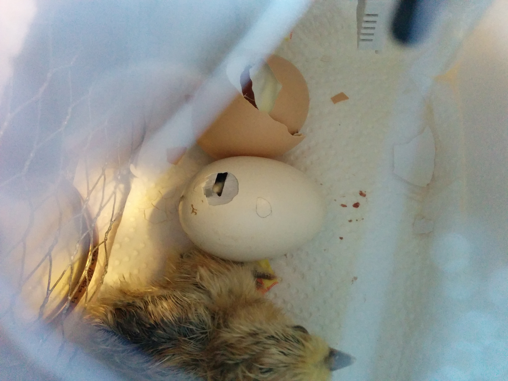
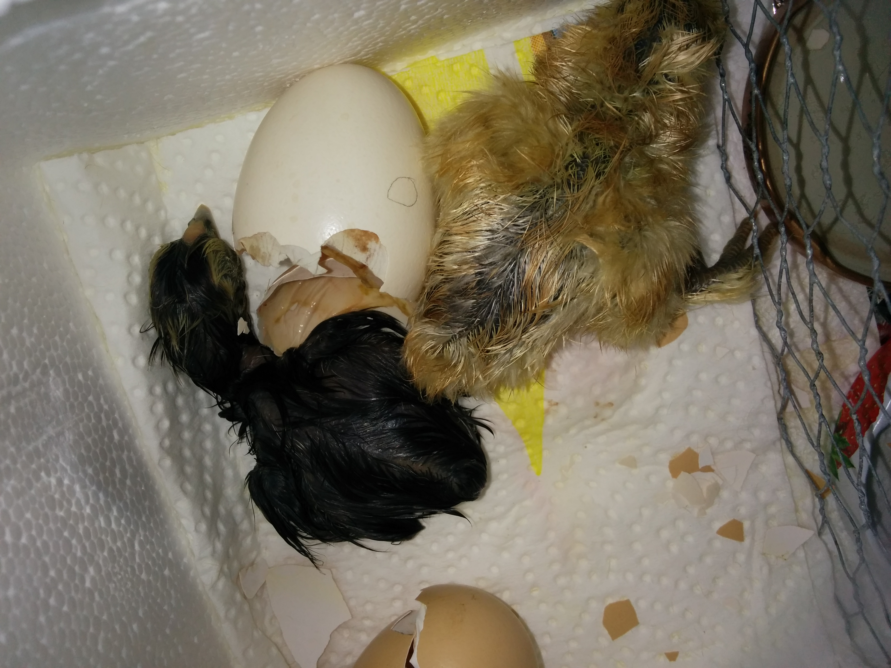

# Egg Incubator

Is an arduino controlled incubator for chicken's eggs. It's purpose is to keep temperature and humidity at defined values, so that the eggs are incubated and the chicks finally hatch after some days.

It might as well be used to incubate other things than chicken's egg like other kinds of eggs (ducks, turtles, alligators, ...), or cultures of bacteria or fungus i.e. to make yoghurt or to leaven yeast/sour dough or to make [Tempeh](https://en.wikipedia.org/wiki/Tempeh).

## Incubation Conditions

Chicken's eggs are incubated for 21 days under temperature and humidity conditions as shown in the table.

| Day   | Temperature [°C] | Humidity [%] |
|:-----:|:----------------:|:------------:|
|  1-17 |      37.8        |    55-50     |
| 18-19 |      37.5        |    55-60     |
| 20-21 |      37.5        |      70      |

Turn the eggs 3 times per day on days 3-17.

The eggs are checked by "x-raying" them with a flashlight on day 7 and 15 (german [schieren](https://de.wikipedia.org/wiki/Schieren_(Biologie))). Dead or unfertilized eggs are sorted out.

## How it works

The arduino constantly measures temperature and humidity. The raw measurements are smoothed using [Holt-Winters double exponential smoothing](https://en.wikipedia.org/wiki/Exponential_smoothing#Double_exponential_smoothing). The smoothed values are then fed into a [PID control loop](https://en.wikipedia.org/wiki/PID_controller).

### Temperature control

The temperature is maintained by turning the heating element on and off in a 2 seconds cycle. The duty cycle of the heater is determined by the temperature PID loop. Using a low frequency pulse width modulation turns a [bang-bang controlled](https://en.wikipedia.org/wiki/Bang%E2%80%93bang_control) heating element into a fully modulated element.

As heating element I highly recommed [Kanthal](https://en.wikipedia.org/wiki/Kanthal_(alloy)) wire (used for styrofoam cutting). 10-15 watts are enough! This is much better than a light bulb. It can be operated with low voltage (safer than 220V bulb), does not emit light and does not burn out. Use a MOSFET to turn it on and off (no heatsink needed due to PWM and no clicking and wearing of a relay).

### Humidity control

The humidity is maintained by opening and closing an air vent on the incubator using a servo. The servo angle is determined by the humidity PID loop. Inside the incubator is a water filled jar. The water warms up and evaporates, the humidity rises, the vent is opened and the humid air can escape letting dryer air in. The air vent is also needed also to allow fresh air and oxygen to get into the incubator. You have to experiment with the size (water surface) of the jar to reach the humidty setpoint and have the air vent (half) open.

### Fan monitoring

The fan does not need to be controlled, it is constantly running and distributes heat and humidity equally in the incubator. I used a 12cm 12V PC fan operated at 5V, so it runs slowly. The Arduino monitors the fan using it's rpm signal and sets of an alarm if it fails. The fan also cools the heating wire, the heating is turned off, if the fan fails.

## Setting it up

### Parts

- [Arduino UNO](https://store.arduino.cc/arduino-uno-rev3)
- [LCD shield](https://www.dfrobot.com/wiki/index.php/Arduino_LCD_KeyPad_Shield_(SKU:_DFR0009)  
  used with [LiquidCrystal library](https://www.arduino.cc/en/Reference/LiquidCrystal)
- [DHT22](https://www.sparkfun.com/datasheets/Sensors/Temperature/DHT22.pdf) temperature and humidity probe used with DHT library
- 12cm PC fan, operated at 5V for low speed
- some Kanthal wire as heating element
- MOSFET as heating switch, like an [IRFZ44N](https://www.infineon.com/dgdl/irfz44n.pdf?fileId=5546d462533600a40153563b3575220b) 
- 5V regulator like an 7805 to power the fan
- [SG90](http://akizukidenshi.com/download/ds/towerpro/SG90.pdf) Servo to open/close the air vent, [SoftwareServo library](https://playground.arduino.cc/ComponentLib/Servo)
- mirco buzzer
- 12V Powersupply (1.5A)
- styrofoam box

### Wiring

Have a look into the code for the pin numers, starting at line 10.

The LCD uses the pins 8, 9, 4, 5, 6, 7 and 10 for the background light and A0 for the input keys.

The fan tacho signal is connected to pin 2 and it is powered with 5V from the 7805 regulator.

The heating wire is powered with 12V, the MOSFET is used as switch with it's gate on pin A1.

The DHT22 T/H probe has it's data pin connected on pin 3, a 10k pullup resistor might be neccessary. 

The air vent servo is connected to pin 11.

The buzzer is connected between ground and A2.

## How does it look like?

Arduino with LCD shield, below 5V regulator with heatsink and the MOSFET

air vent made from clear plastic, the servo turns the disk of the vent to open/close it

fan with heating wire in the back, T/H on the left

close up of fan with heating wire

## Hatching Chicks

